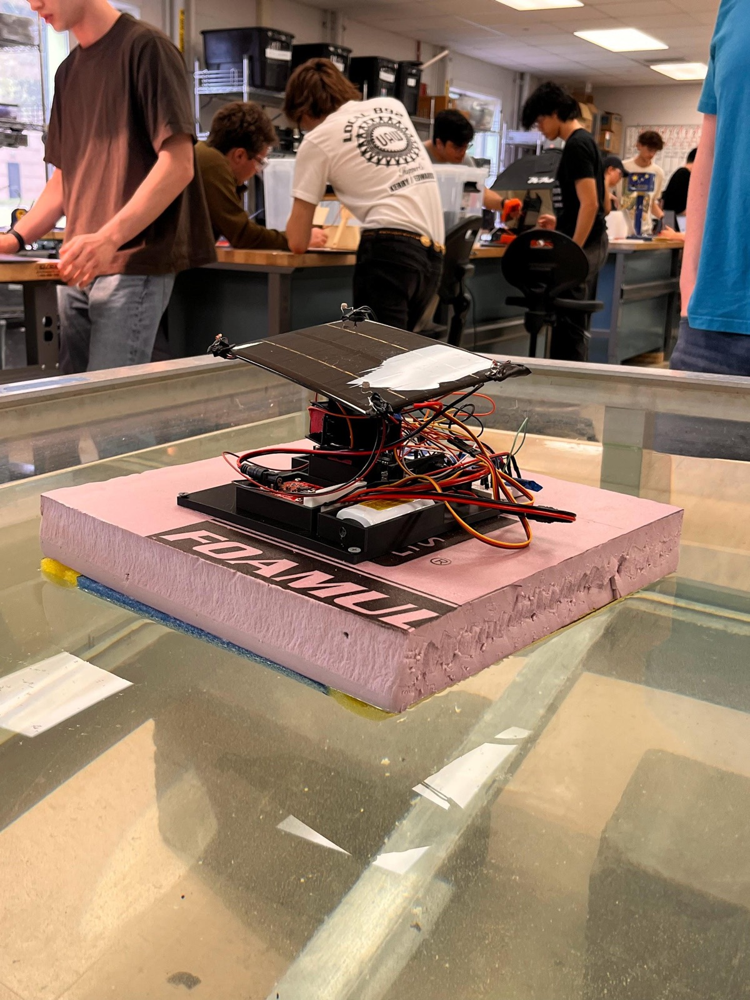

# Solar Tracking for Autonomous Drone Boats

**A dual-axis, light-seeking solar tracker on a floating prototype hull. In lab testing, it generated about 40% more energy than a fixed panel.**

Team project ("The Ohmericans") for the University of Michigan E100 Solar Power course: Kevin Amalraj, Mihir Epel, Curtis Harding, Nathan Trumbull. Final report dated April 26, 2026.



---

## At a glance

| | |
| :-- | :-- |
| **Problem** | Solar-powered autonomous boats used for marine research lose energy because waves rock the boat and the sun moves, so a fixed panel is rarely aimed at the brightest spot. |
| **Solution** | A two-servo pan/tilt gimbal carries the panel. Four photoresistors, one at each corner of the panel, feed an Arduino, which steers the panel toward the brightest light. |
| **Platform** | Arduino microcontroller, 2 hobby servos, 4 photoresistors, solar panel, Sunny Buddy solar charge controller, onboard battery |
| **Mechanical** | Foam and pool-noodle raft hull, custom CAD-designed 3D-printed electronics mount |
| **Headline result** | The tracker tracked the light source in all tests, slewed at about 60 deg/s, and gave roughly **40% more energy** than a fixed panel under identical lamp conditions. |
| **Status** | Completed prototype (proof of concept) |

## Key results

- **Tracking worked in every test run.** The panel started from different positions and the light and boat were moved between runs. The tracker slewed at about 60 deg/s, far faster than the sun moves.
- **About 40% more energy than a fixed panel** in the aggregated comparison. The test was a controlled lamp test at about 300 W/m² (roughly 1/4 of full sun), and the power draw of the servos and photoresistors was included on the tracking side ([details](docs/testing_and_results.md)).
- **At this low irradiance, a fixed panel could not sustain even the minimal electronics.** The tracking configuration fared better on net energy.
- **The prototype floated stably** and never came close to capsizing or taking on water, even while the panel moved.

For the full story, including requirements I did not fully meet, read [Requirements vs. Outcomes](docs/requirements_and_outcomes.md).

## What I did and what it shows

This was a full hardware-to-data cycle: requirements, mechanical design, wiring, firmware, instrumented testing, data analysis, and an engineering and business write-up.

| Area | What was done |
| :-- | :-- |
| Embedded firmware | Arduino control loop that reads four analog light sensors and drives two servos with a dead-band differential tracking algorithm |
| Sensing | Four photoresistors in a quad-sensor layout, read through the Arduino's ADC |
| Actuation | Pan/tilt gimbal built from two servos |
| Power systems | Solar panel, charge controller and battery. Net-power-into-battery measurement, including the tracker's own power draw |
| Mechanical / CAD | Enclosure and mounting plate modeled in CAD and 3D printed, with compartments planned around the real components |
| Test and validation | Controlled A/B test (gimbal vs. fixed) with a calibrated lamp, stepped angle sweep, and aggregated-energy analysis |
| Engineering process | Six written requirements, each evaluated against results, plus a second-design-cycle plan |
| Communication | Formal team report, stakeholder analysis, and cost analysis |

A complete skills-to-evidence map is in [Skills Demonstrated](docs/skills_demonstrated.md).

## Documentation map

| Document | What is in it |
| :-- | :-- |
| [Project Overview](project_overview.md) | Problem, existing solutions, goals, and solution concept |
| [Design and Build Process](docs/design_and_build.md) | The three build phases in order: buoyancy, electronics, firmware |
| [Firmware](docs/firmware.md) | How the light-tracking algorithm works |
| [Requirements vs. Outcomes](docs/requirements_and_outcomes.md) | Six requirements and the results, including what was out of scope |
| [Testing and Results](docs/testing_and_results.md) | Test setup, assumptions, data, and conclusions |
| [Business and Cost Analysis](docs/business_and_cost_analysis.md) | Stakeholders, cost estimate, and recommendation |
| [Lessons and Next Steps](docs/lessons_and_next_steps.md) | Limitations and the second design cycle |
| [Skills Demonstrated](docs/skills_demonstrated.md) | Skills, each tied to evidence in this project |
| [Full Final Report (PDF)](report/Ohmericans_Final_Report.pdf) | The complete team report |

## Repository layout

```text
Autonomous Solar-Powered Boat/
├── README.md                  <- you are here
├── project_overview.md
├── docs/                      <- design, firmware, testing, analysis, skills
├── images/                    <- photos, CAD, code screenshot, test graphs
└── report/
    └── Ohmericans_Final_Report.pdf
```

## Honest scope note

This is a **proof-of-concept prototype** tested in a lab water tank under lamp light. Full waterproofing, night shutdown behavior, real-world wave testing, and autonomous navigation and propulsion were not part of the delivered prototype. They are covered candidly in the documentation, along with how a second design cycle would address them.
