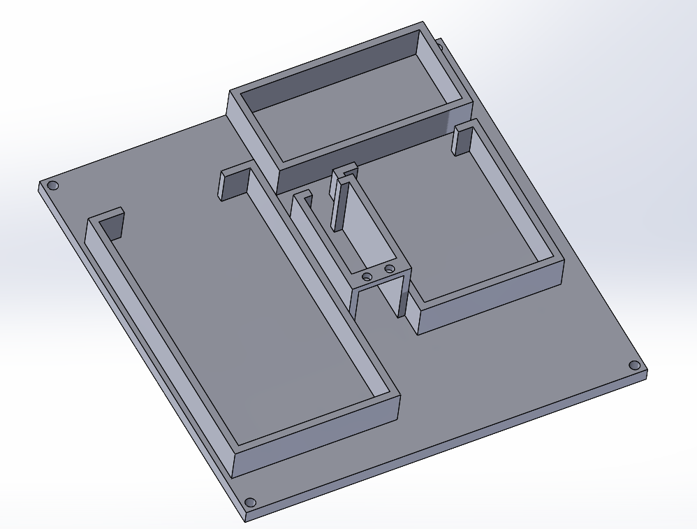

# Design and Build Process

[← Back to project README](../README.md)

The build was done in three phases. The mechanical layout was planned in CAD *before* any wiring began, so assembly was mostly a matter of placing components in their reserved spots and wiring them correctly.

```text
Concept sketch -> 1. Buoyancy and enclosure -> 2. Electronics and wiring -> 3. Firmware -> Test in water tank
```

---

## Step 0: Concept and planning

- The team sketched the system architecture first: panel, gimbal, sensors, electronics case, and floating base ([Figure 1](../images/fig1_initial_concept_sketch.png)).
- The sketch defined the main subsystems: a two-servo pan/tilt mechanism, four corner-mounted photoresistors each in a water-protector housing, an electronics case holding the Arduino, and a foam base.
- Six measurable requirements were set before building (see [Requirements vs. Outcomes](requirements_and_outcomes.md)).

## Step 1: Buoyancy and waterproofing

**Goal:** a stable, high-buoyancy platform that keeps electronics off the water.

1. **Material selection.** The team surveyed the lab for materials and chose thick, firm foam and pool noodles for the raft.
2. **Stability decision.** A wide piece of foam was used so that neither the moving panel nor waves would tip the boat.
3. **Enclosure design in CAD.** A custom electronics mount was modeled. It has walled compartments sized for the components and sits in the center of the foam ([Figure 2](../images/fig2_cad_electronics_mount.png)).
4. **3D printing.** The mount was 3D printed. It holds components in place and gives some splash protection. Because the raft sits high, the electronics are also raised away from the water.



*Figure 2: CAD model of the electronics mount. It has a base plate with corner mounting holes and separate walled compartments for the components.*

**Engineering observation:** the foam and pool noodles turned out to be significantly more buoyant than required. The boat sat high and was very stable, but most electrical components stayed exposed from above. The design protects against splashing, not submersion (see [Requirement 2](requirements_and_outcomes.md)).

## Step 2: Electrical assembly

**Goal:** wire everything so the components work together reliably.

1. Because placement had been planned in CAD, each component went into its designated spot in the enclosure.
2. The components were wired on a breadboard. These are the parts the report names:
   - **Arduino**, the controller
   - **Two servos**, which give the panel two rotational axes (pan and tilt)
   - **Four photoresistors**, one at each corner of the panel, reading light intensity
   - **Solar panel**, the power source
   - **Sunny Buddy**, the solar charging circuit
   - **Onboard battery**, charged by the panel
3. The solar panel was mounted on the two-servo gimbal and the photoresistors on its corners. They feed light-intensity values to the Arduino, which decides where to move the panel.

## Step 3: Firmware

**Goal:** turn four light readings into panel motion.

The program reads the four photoresistors and drives the two servos so the panel turns toward the brightest light. The algorithm is described in [Firmware](firmware.md).

## Step 4: Integration and test

The finished boat was tested in the lab's water tank with a lamp standing in for the sun. See [Testing and Results](testing_and_results.md).


*The assembled prototype floating in the lab tank. Visible: the foam hull, the 3D-printed base, the breadboard wiring, the battery, and the angled solar panel.*
