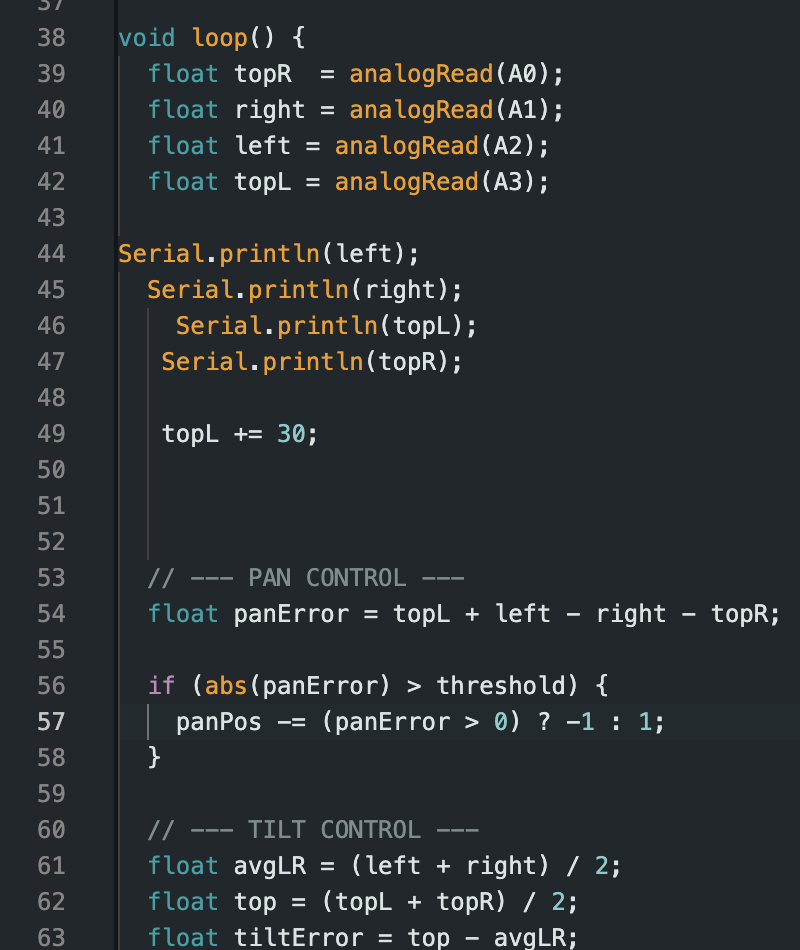

# Firmware: Light-Tracking Control Loop

[← Back to project README](../README.md)

The firmware runs on an Arduino. It is a simple closed-loop tracker. It compares light on opposite sides of the panel and nudges the servos toward the brighter side until the readings are balanced.

*Figure 3: The light-tracking section of the Arduino code, from the final report.*

## How it works

1. **Sense.** Read the four photoresistors on the panel corners (top-left, top-right, bottom-left, bottom-right) through the Arduino's analog inputs.
2. **Condition.** Print the raw readings to the serial monitor for debugging. Apply a small software offset to compensate for differences between individual sensors.
3. **Pan axis.** Compare the combined left pair with the combined right pair. If the difference is larger than a threshold, step the pan servo one increment toward the brighter side.
4. **Tilt axis.** Compare the average of the top pair with the average of the bottom pair to get a tilt error, and step the tilt servo toward the brighter side in the same way.
5. **Repeat.** Loop continuously, so the panel keeps following the light as the sun or the boat moves.

## Design notes

| Choice | Why it matters |
| :-- | :-- |
| **Four sensors in a quadrant layout** | Comparing pairs of sensors gives a direction to move, not just a brightness level. This is the same idea as a quad-cell sun sensor. |
| **Dead-band threshold** | Small differences are ignored, so the servos don't jitter or waste power chasing noise. Every servo movement costs energy that the panel has to make back. |
| **Incremental stepping** | Small position steps keep the motion smooth and stable, and the loop is simple to reason about and debug. |
| **Serial debug output** | The raw readings were visible while testing, which made sensor behavior and calibration easy to check. |
| **Per-sensor calibration offset** | Low-cost photoresistors vary from part to part. A software offset corrects the imbalance without hardware changes. |

## Performance

- The panel slews at about **60 degrees per second**, far faster than the sun's apparent motion. The team believes this should also be enough to respond to boat motion in waves, but wave-condition testing was not done.
- Net power measurements **include the servos' and photoresistors' draw** for the tracking configuration. The efficiency comparison was therefore not flattered by ignoring the cost of tracking (see [Testing and Results](testing_and_results.md)).

## Designed, but not validated: low-light shutdown

The design calls for the gimbal to stop searching when the photosensor readings fall below a set minimum. That would save power at night or whenever tracking costs more energy than it produces. The report states that **this feature was not tested**, because that would need a continuous multi-day test, so it is treated as future work. See [Requirements vs. Outcomes](requirements_and_outcomes.md).

## Known improvement: gyroscope

A gyroscope to counteract boat motion was part of the initial concept and is listed as a planned upgrade. It was not implemented in the prototype.
