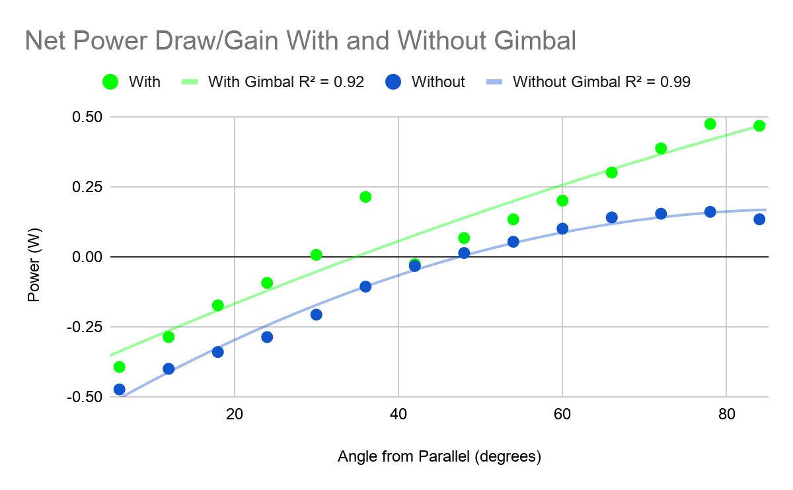
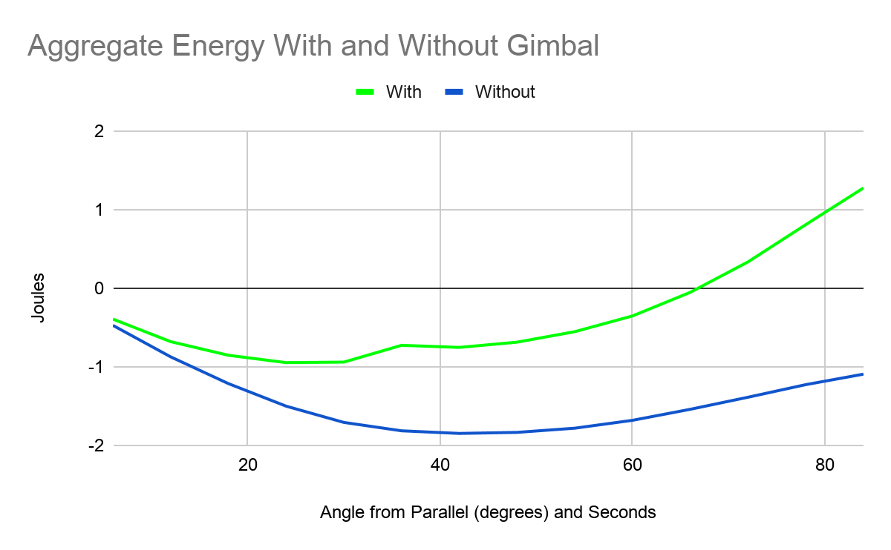
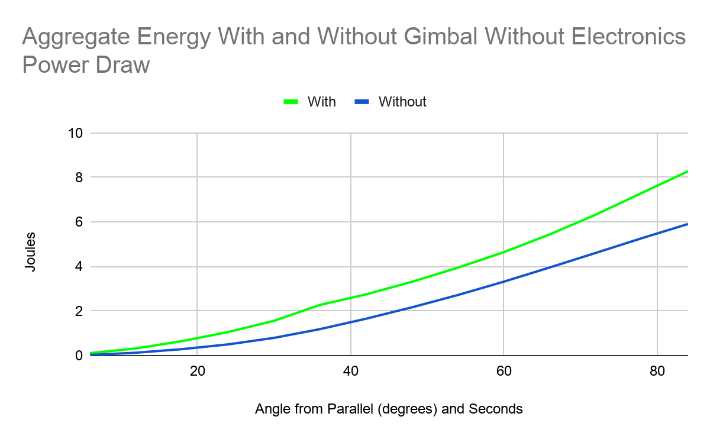
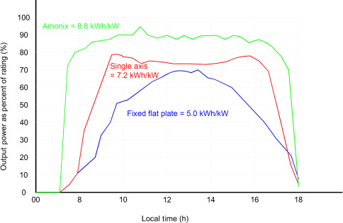

# Testing and Results

[← Back to project README](../README.md)

## Objective

Compare the tracking prototype against a **fixed solar panel** under lab conditions that mimic a day of sunlight, and estimate how much more energy the tracker delivers.

## Test setup

| Item | Detail |
| :-- | :-- |
| **Location** | The lab's water tank, with the prototype floating |
| **Light source** | A lamp standing in for the sun |
| **Irradiance** | Calibrated to about **300 W/m²** for every test. That is roughly 4× lower than full sun, but it was the closest to a real daytime test the time limit allowed. |
| **Sun geometry** | Lamp placed at an angle. In Ann Arbor at this time of year, the sun is about 30° off straight-up. |
| **Configurations compared** | (A) Fixed panel. (B) Two-axis tracking gimbal. |
| **Measured quantity** | **Net power flowing into the battery** |
| **What "net" includes** | Draw from the Arduino and the Sunny Buddy. For the gimbal runs, it also includes the draw from the servos and photoresistors. |

## Procedure

1. Calibrate the lamp to about 300 W/m².
2. Start with the panel pointing straight up.
3. Take net-power measurements at **incrementing angles** to replicate the sun moving across the sky and setting. The first data point is at 6 degrees.
4. Repeat for the fixed and the tracking configuration.
5. Estimate total energy over the whole sweep by aggregating the power readings.

Additional checks during testing:

- The light was moved, and the boat was moved, with the panel starting from **different positions** each time. This confirmed that the tracker finds the light from any starting pose.
- The prototype was floated in the tank to confirm buoyancy and stability while the panel moved.

### Deliberate choices and assumptions

- **No reading at 0 degrees** (panel perpendicular to the lamp). The team felt that the panel would mostly collect ambient room light there and not represent sunlight accurately.
- **Time between readings is treated as irrelevant**, about one second each, so the energy is aggregated in joules. This depends on the panel not heating up much during the test.
- The goal was a **proof of concept** and a good **estimate of relative improvement**, not an exact measurement of battery charge.

## Results

### Raw net power

*Figure 5: Net power into the battery at each test angle, with and without the gimbal.*

Most net-power readings are **negative**, meaning the battery was being drained instead of charged. That was expected, given the lamp's low irradiance and the quality of the small panel. The useful information is in the *comparison* between the two configurations.

### Aggregated energy

*Figure 6: The same data aggregated into energy (joules).*

Values are also negative here. At this low light level the **fixed panel could not even sustain the minimal electronics**, and the tracking configuration did better on the same measure.

### Comparison without baseline electronics draw

*Figure 7: The aggregated energy with the Arduino and Sunny Buddy draw removed. The tracking data still includes the servos and photoresistors, to keep the comparison fair.*

**Conclusion from the data:** the prototype was about **40% more efficient** over a typical day than a fixed panel.

### Reference comparison

*Figure 4: Published reference data comparing fixed, single-axis, and dual-axis panels. The prototype's results replicate the trend in this reference.*

## Other measured or observed results

| Result | Value |
| :-- | :-- |
| Energy gain vs. fixed panel | about 40% |
| Tracking speed | about 60 degrees per second |
| Floating and stability | Stable, with no capsizing or water intake |
| Tracking success | Tracked the light source in all tests, from varied starting positions |

## Limitations of the testing (stated honestly)

- **Low irradiance (about 300 W/m²).** Real sun is about 4× stronger, so absolute numbers do not transfer. The relative comparison is the useful finding.
- **A lamp, not the sun**, and a controlled tank, not waves. Wave response was not directly tested.
- **Fixed one-second spacing assumption** between readings.
- **No multi-day test**, so the night-shutdown behavior is unvalidated.
- **Prototype-grade panel and sensors.** The report notes the 40% gain remains significant even allowing for systematic error.

## What this demonstrates

Controlled A/B experiment design, calibrated test conditions, instrumenting net power with overhead included, stating assumptions explicitly, and drawing conclusions proportionate to the evidence.
