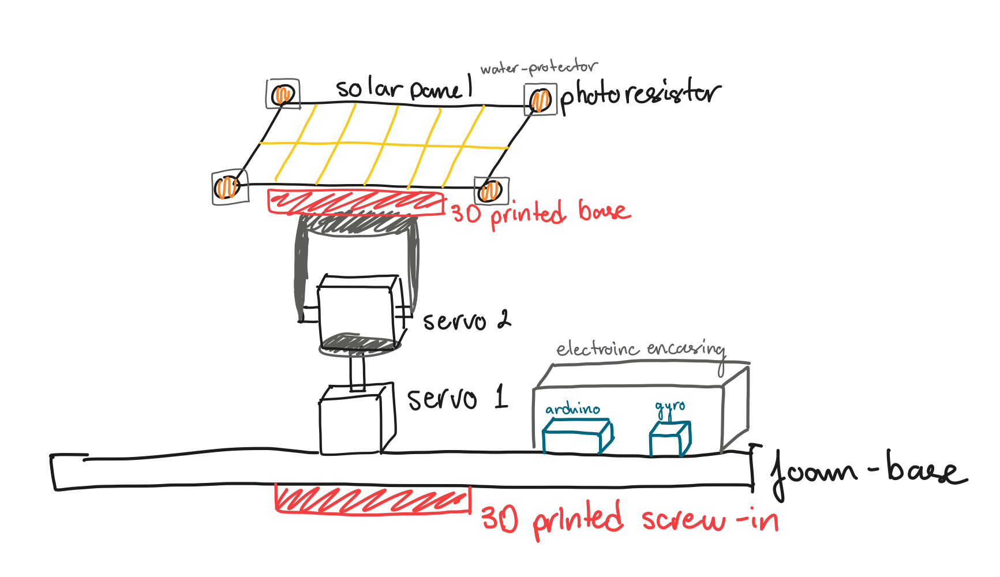

# Project Overview

[← Back to project README](README.md)

## The problem

Marine biologists who study migration patterns increasingly use autonomous drone boats to follow and track sea life and relay data back to shore. Many of these boats are moving to solar power, but a **stationary solar panel is often not efficient enough**:

- Waves rock the boat, so the panel keeps changing orientation.
- The sun moves across the sky during the day, so a fixed panel is not always aimed at the brightest spot.

Lost power can mean lost data, which can lead to incomplete or inaccurate maps of migration patterns.

## Existing solutions and their limits

Few drone boats use solar tracking today. Beyond the efficiency problem, autonomous data-collection boats face legal limits involving data collection and maritime boundaries. Better energy efficiency means more data collected, and that could support the case for easing some of those limits.

## Goal

Build a device that can be attached to a drone boat and **tracks the point of maximum light to raise solar efficiency**, then prove it with data.

The project drew on skills from earlier in the course: servos, Arduino programming, 3D CAD modeling, and breadboard wiring.

**Key objectives**

1. A base that floats and keeps the electronics safe from water.
2. An electronics setup that lets the panel move freely and correctly toward the point of maximum light.

## Solution concept

The design is a foam-and-pool-noodle raft carrying a 3D-printed electronics base, with a solar panel on a two-servo gimbal.

*Figure 1: The team's initial concept sketch. It shows a four-photoresistor solar panel on a two-servo pan/tilt gimbal, an electronics case holding the Arduino, and a foam base. The sketch also shows a gyroscope. That was not implemented in the prototype and became a planned improvement (see [Lessons and Next Steps](docs/lessons_and_next_steps.md)).*

| Part | Purpose | Details |
| :-- | :-- | :-- |
| **1. Buoyancy and waterproofing** | A stable, high-buoyancy platform with protected electronics | Thick, firm foam and pool noodles for the raft, plus a 3D-printed case with side walls that sits in the center of the foam |
| **2. Electrical components** | Sense the light and move the panel | The solar panel rides on two servos (two axes). A photoresistor at each corner reads light intensity for the Arduino |
| **3. Code** | Turn sensor readings into motion | An Arduino program reads the photoresistors and commands the two-servo gimbal |

See [Design and Build Process](docs/design_and_build.md) for the step-by-step detail.
